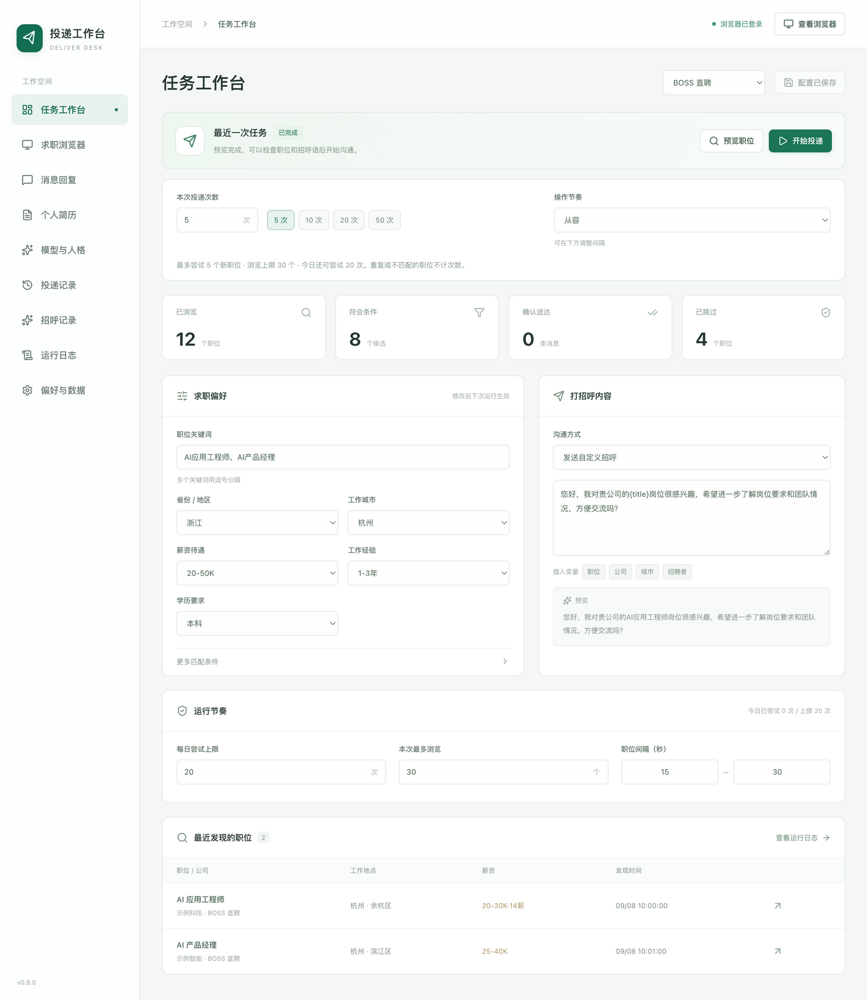

# DeliverDesk · 投递工作台

[](https://github.com/likeyeee/deliver-desk/actions/workflows/ci.yml)
[](https://github.com/likeyeee/deliver-desk/releases)

本地运行的 BOSS 直聘求职工作台：筛选职位、预览文案、发起沟通、核对送达、管理历史。



## 下载

| 系统                  | 安装包                                                                                                          |
| --------------------- | --------------------------------------------------------------------------------------------------------------- |
| macOS · Apple Silicon | [下载 DMG](https://github.com/likeyeee/deliver-desk/releases/download/v0.2.0/DeliverDesk-0.2.0-mac-arm64.dmg)   |
| Windows · x64         | [下载安装程序](https://github.com/likeyeee/deliver-desk/releases/download/v0.2.0/DeliverDesk-0.2.0-win-x64.exe) |

安装包自带运行环境。当前为未签名测试版；[安装说明与验证范围](docs/desktop-guide.md)。

## 使用

1. 打开应用，在内置浏览器中扫码登录。
2. 设置关键词、城市、筛选条件和招呼语，点击 **预览职位**。
3. 确认结果后点击 **开始投递**；运行中可暂停、继续或停止。
4. 在 **投递记录** 查看结果、只读核对送达，或导出 CSV。

历史去重跨重启保留；无法确认的发送不会自动重试。登录和记录保存在本机。“投递”指发起沟通，不自动上传简历附件。

## 开发

需要 Node.js 24 和 [uv](https://docs.astral.sh/uv/getting-started/installation/)。

```sh
git clone https://github.com/likeyeee/deliver-desk.git
cd deliver-desk
uv sync --locked
npm ci
npm start
```

```sh
npm run lint          # Python、前端和文档格式
npm run test:python   # 需要 Google Chrome
npm run test:desktop  # Electron + Python 隔离集成测试
```

```text
desktop/        Electron 主进程与 React 界面
src/boss_cli/   Python 任务核心与 CLI
tests/          匹配、去重、浏览器和进程测试
scripts/        构建、验证、发布工具
examples/       示例配置
docs/           使用、架构、适配与发布记录
```

[使用文档](docs/README.md) · [CLI](docs/cli.md) · [构建与发布](docs/releasing.md) · [参与贡献](CONTRIBUTING.md) · [问题反馈](https://github.com/likeyeee/deliver-desk/issues/new/choose)

## 最新更新

### 2026-09-08

- 提供 macOS / Windows 桌面安装包，支持预览、投递控制、历史和 CSV 导出。
- 增加目标职位核对、历史去重和“只读核对送达”。
- 修复 Windows 打包服务的中文编码问题。

[完整发布记录](docs/releases/release-notes.md)
