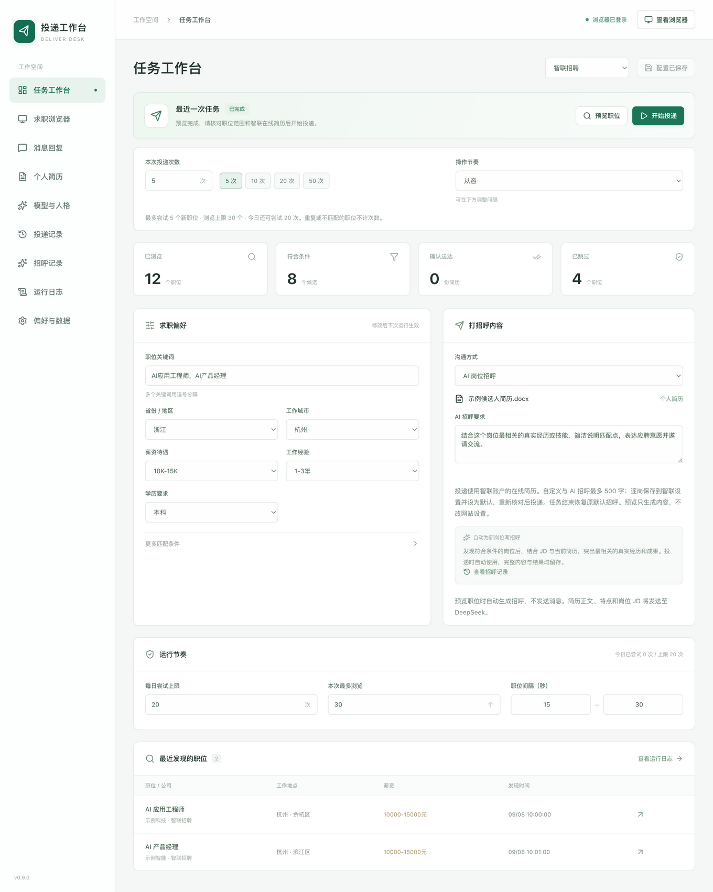

# 投递工作台

安装包自带运行环境，无需安装 Python、Node.js 或命令行工具。

## 使用

1. 在工作台选择“本次投递平台”，点击“扫码登录”。网站显示在主窗口的“求职浏览器”页，也可在浏览器工具栏切换平台。智联使用微信扫一扫，首次登录按网站提示完成账号绑定；扫码过期时使用网站的刷新入口。两个平台分别保存登录，原有 BOSS 账号无需迁移。
2. 填写关键词，依次选择“省份 / 地区”和“工作城市”，再设置薪资、经验和学历。例如选择“福建 → 泉州”或“广东 → 深圳”。其他条件在“更多匹配条件”里；筛选文字必须与网站提供的选项一致。
3. 点击“预览职位”。这一步不会投递简历或发送消息。通过预览确认职位范围。
4. 在启动区填写“本次投递次数”（1–200），或选择 5 / 10 / 20 / 50 次，再选择操作节奏。点击“开始投递”并确认范围，界面自动切到浏览器，显示进度和当前步骤。运行中可暂停、继续或停止；切到日志或工作台后任务仍可继续。
5. 在“投递记录”查看实际文本与结果，导出 CSV；“运行日志”显示进度和失败原因。待核对记录可点击“只读核对送达”，重新检查原消息、目标职位与网站回执，成功后更新历史。这一步不发送新消息；无法确认时保留原状态并继续阻止自动重发。

省市列表覆盖 34 个省级地区、373 个城市选项；切换省份后会选中该省的第一个城市，可继续选择目标城市。BOSS 可选“全国”，智联当前需选择具体城市，并以智联网页实际提供的选项为准。已保存的城市会自动匹配省份，旧配置中手动填写的其他城市也会保留。切换城市会清除旧城市的“工作区域”，其他条件继续保留。[城市目录来源](research/regions.md)

切换平台会保存当前偏好，并分别记住两个平台的网页筛选条件。任务或自动回复运行时不能切换平台。投递记录支持按平台筛选；同一数据目录中的每日尝试上限由两个平台共用。

## 智联简历投递

登录后先在智联网站确认在线简历。在工作台“打招呼内容”选择“AI 岗位招呼”，应用会读取每个岗位的 JD，结合上传的简历正文与已核对特点生成完整招呼。正式投递时，依次打开智联聊天设置、保存本岗位自定义招呼并设为默认、重新加载核对内容，再返回岗位投递在线简历。网站成功弹窗中的招呼必须与生成原文一致，才记为送达并继续下一岗。

AI 招呼会同时核对引用的简历原句，依据可以在“招呼记录”查看；出处缺失时停止。AI 模式需先配置 DeepSeek、上传并分析简历；也可选择“发送自定义招呼”使用带岗位变量的模板，或选择“使用网站当前招呼”沿用原网站设置。后两种模式不调用 AI。智联招呼最多 500 字，超长或生成、保存、核对失败时停止，不截断后发送。

预览只生成并保存招呼记录，不改网站设置、不联系招聘方。正式投递复用一个应用创建的自定义条目，任务完成或停止后恢复原默认招呼；如果你在运行中另选了默认招呼，会保留你的选择。应用不会改写其他自定义条目。恢复失败会提示检查聊天设置。

“更多匹配条件”里的公司行业与职位类型需按网页层级填写，例如“汽车/摩托车/电动车 > 汽车4S店/经销商”；要选择整个大类，可在末级填写“不限”。其他条件使用智联网页显示的选项文字。

已投递、已沟通和待核对的职位会跳过；回执不明确时停止且不会自动重投。“只读核对送达”可通过智联求职反馈检查平台招呼模式的简历投递；定制招呼还需原文一致的回执，只有简历成功记录时不会把消息判定为送达。“继续沟通”按钮本身不足以确认简历已送达。消息回复和自动回复目前支持 BOSS，智联后续聊天请在网页处理。



## BOSS 沟通与回复

只建立沟通不会计为“已送达”。自定义消息需同时出现新的本人消息、输入框清空和送达/已读回执才计为发送成功。招聘方已明确拒绝的会话不会继续发消息。

浏览器页会占满应用窗口，网页宽度随窗口大小自动适配；上方保留暂停、停止、运行日志和返回工作台。网页仍可正常上下滚动。同一公司有多个联系人时，会按职位详情中的招聘者姓名定位，再核对具体职位；无法区分的同名联系人仍需人工核对。

聊天中的职位核对在后台完成，同一会话等待回执时不会反复切回职位页。网页悬浮按钮只遮挡发送按钮的一部分时，会点击仍露出的有效区域；完全遮挡或切换联系人时停止任务。

需要生成后续回复时，在“模型与人格”配置 DeepSeek 和自定义系统提示词，再到“消息回复”选择已沟通职位、读取对话、生成可编辑草稿，确认后发送。密钥加密保存在本机；生成时会把选中会话的近期消息和人格提示词发送给 DeepSeek。详细流程见 [模型与消息回复](llm-replies.md)。

也可以打开“消息回复”顶部的“自动回复”，自动寻找招聘方发来但本人尚未回复的会话，包含已读消息。每轮扫描后等待 30 秒再检查，发现、生成、发送和错误都有日志；可随时关闭，退出或重启应用后保持关闭。“扫描待回复”只读取会话，不调用模型或发送。回复不再设置 Token 参数或 1,000 字上限；模型报告截断时停止，不发送不完整正文。

## 简历与岗位招呼（BOSS / 智联）

在“个人简历”上传 PDF、DOCX、TXT 或粘贴正文，点击“分析简历”，核对 DeepSeek 提取的个人概况、技能、经历和优势后保存。点击“使用 AI 岗位招呼”回到工作台，可设置招呼要求。预览或投递发现符合条件的新岗位时，会自动根据 JD 和当前简历生成招呼；预览不发送，正式投递自动使用。完整内容、生成依据与结果保存在“招呼记录”，资料和要求未变时沿用已有招呼。生成失败时停止，不发起沟通。详细流程与文件要求见 [简历与岗位招呼](resume-greetings.md)。

## 次数与节奏

- “本次投递次数”限制新发起的尝试，重复记录和不匹配职位不占用次数。已尝试和确认送达分别显示，未确认结果仍会停止整批。
- “每日尝试上限”独立生效。启动区显示今日余额；目标高于余额时会提前提示，不会自动调大每日上限。
- 调大投递次数会同步扩大浏览范围。“本次最多浏览”、搜索关键词和翻页范围仍会限制可发现的职位；如果不足以完成目标，结束时会显示具体原因。
- “流畅”“均衡”“从容”提供不同的随机间隔，也可在“运行节奏”和“偏好与数据”里自定义。流畅档的职位间隔为 8–16 秒，每 5 次休息 30–60 秒；实际耗时还取决于页面和回执加载。
- 已登录页面与详情页会复用，页面内容就绪后继续处理；批次休息不再叠加普通职位间隔。浏览器中的返回、刷新和关闭按钮在任务运行时禁用，避免切走正在操作的目标。

遇到安全验证、网站限制、页面空白或收件人无法核对，任务停止并保留浏览器和现场。请在浏览器手动处理，然后重新运行。程序不绕过验证、不更换账号、不自动重发不确定的消息。

## 安装与数据

- macOS：使用对应芯片版本的 DMG，把应用拖到 Applications。当前本机产物为 Apple Silicon / arm64。Intel Mac 需在 Intel 构建机重建 Python 核心和 Electron x64 包。
- Windows：使用 x64 安装程序，或将 ZIP 完整解压后运行“投递工作台.exe”。不要从 ZIP 内直接运行单个 EXE，也不要移走 resources 目录。
- 应用尚未使用开发者发行证书签名和公证。系统可能要求用户在系统安全设置里确认来源。正式面向大量用户发布前，需配置自己的签名证书和 macOS 公证。
- 每台机器有独立登录与历史。新安装包不包含开发者的个人账号、二维码、聊天、配置或投递记录。
- 在“偏好与数据 → 打开目录”可找到本机数据。配置导出带任务设置、模型参数和系统提示词，不含 API Key、简历正文或分析结果；招呼记录包含引用的简历原句，提示词和 CSV 也可能带个人资料，请按需要分享。
- 导入简历只在本机提取文字，点击分析或使用 AI 岗位招呼后，简历正文、特点和相关职位资料会发送至 DeepSeek。简历不会自动作为附件发送给招聘方。移除简历不删除原文件和已有招呼、投递记录。招呼记录含当时的 JD 与简历特点，请按个人资料保管。

## 开发

```sh
uv sync --locked --python 3.12
npm ci
npm start
```

开发环境的数据默认位于 `.boss-cli/desktop/state`。`DELIVERDESK_DEV_DATA_DIR` 可指定独立开发数据目录；`DELIVERDESK_WORKSPACE=1` 可读取当前项目的 `.boss-cli` 历史。发行应用忽略这两个开关。

```sh
uv run pytest -q
npm run test:desktop
npm run test:ui
npm run build:backend
npx electron scripts/desktop-smoke.cjs --packaged-backend
node scripts/build-icons.cjs
npm run pack:mac
```

Windows 机器执行 `npm run pack:win`，会先用 Windows Python 构建本机服务，再生成 NSIS 安装程序和 ZIP。`.github/workflows/desktop-build.yml` 包含 macOS / Windows 原生构建和隔离测试任务。构建记录见 [GitHub Actions](https://github.com/likeyeee/deliver-desk/actions/workflows/desktop-build.yml)；安装程序及校验值见 [Releases](https://github.com/likeyeee/deliver-desk/releases)。

在 Mac 准备 Windows 包也可使用：

```sh
uv run python scripts/build_windows_backend.py
npx electron-builder --config desktop/windows-cross.cjs --win --x64 --publish never
```

这条流程校验 Python 官网的压缩包 SHA-256，安装锁定版本的 Windows wheel，并自带离线运行时。跨平台生成成功不等于已经在真实 Windows 机器上完成启动验证。打包钩子会拒绝将 Mac Python 核心放进 Windows 包。

## 浏览器问题的处理

原 CLI 使用 Playwright 驱动 Chrome 时，本机出现过 BOSS code=37 与 about:blank。桌面版改用 Electron 自有浏览器，通过主进程提供的 DOM 和鼠标接口执行现有任务流程，不连接普通 Chrome 的调试端口。网站使用独立的 WebContentsView，不加载应用 preload，Node.js 关闭，沙箱和隔离开启。

2026-09-08 的真实验证已完成：新浏览器恢复登录，自动搜索“AI应用”，选择泉州、经验不限，读取详情并预览；随后通过完整聊天页自动发送一条自定义招呼。首次发送后，旧消息选择器漏识别了网站已经显示的“送达”。修正为新版己方消息结构后，重启应用并执行“只读核对送达”，确认原文和回执仍存在，历史更新为已送达；再次处理同一真实职位时，在浏览器操作前直接跳过，发送尝试数未增加。

修正包括等待城市和结果加载完成、避免页面更新期间的重复定位、从简易沟通弹窗转到完整会话，以及识别新版消息气泡。完整聊天页通过网站的“查看职位”核对实际职位 ID，不能仅凭公司名或联系人列表顺序发送。当前记录保留了首次回执识别失败和后续只读核验的过程。

自动检查覆盖 Python 核心、浏览器和进程测试，以及 Electron 与打包 Python 服务的隔离流程。macOS / Windows 的原生服务均已在 GitHub Actions 执行；结果见 [CI](https://github.com/likeyeee/deliver-desk/actions/workflows/ci.yml) 和 [原生构建](https://github.com/likeyeee/deliver-desk/actions/workflows/desktop-build.yml)。macOS 安装版已实际启动并恢复登录；Windows 安装向导和真实账号登录仍需实机验收。网站后续布局变化可能需要继续适配。

参考依据：[Electron WebContentsView](https://www.electronjs.org/docs/latest/api/web-contents-view)、[BaseWindow](https://www.electronjs.org/docs/latest/api/base-window)、[Electron 安全建议](https://www.electronjs.org/docs/latest/tutorial/security)、[Python Windows 嵌入式发行包](https://docs.python.org/3/using/windows.html#the-embeddable-package)、[electron-builder 跨平台构建](https://www.electron.build/docs/features/multi-platform-build/)。原有 BOSS 页面适配研究见 [GitHub 项目研究](research/github-reference.md)。
