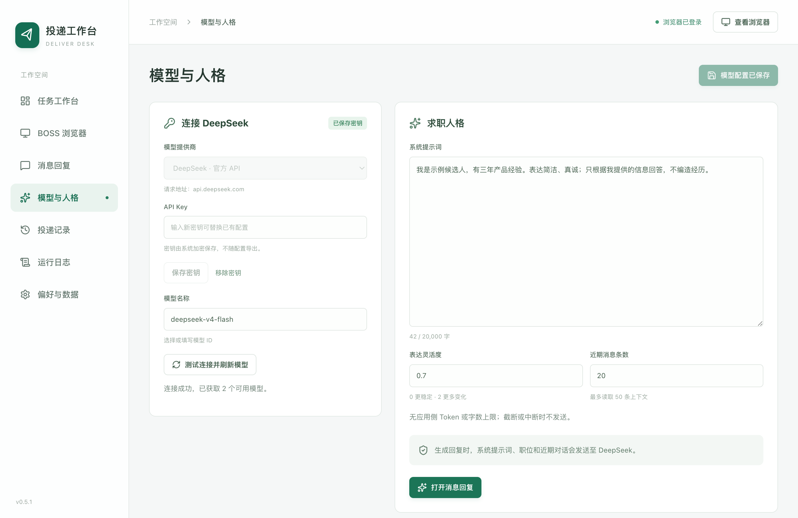
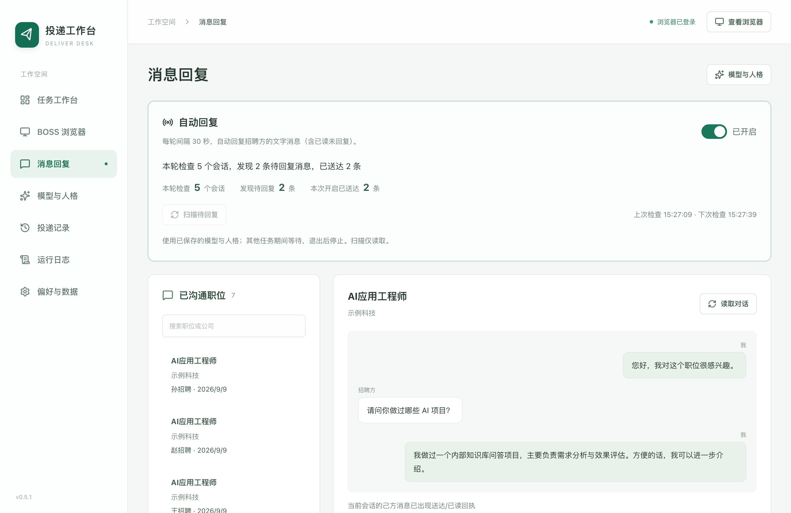
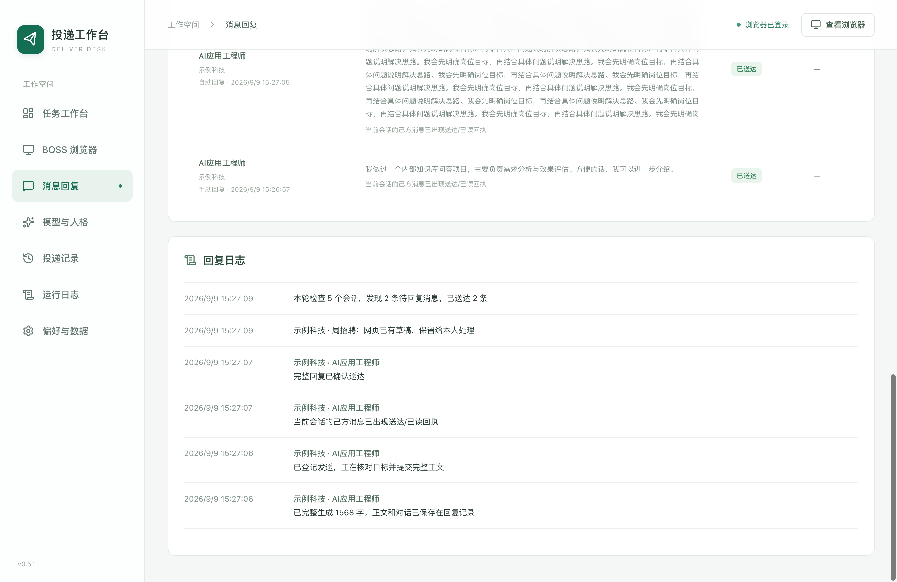
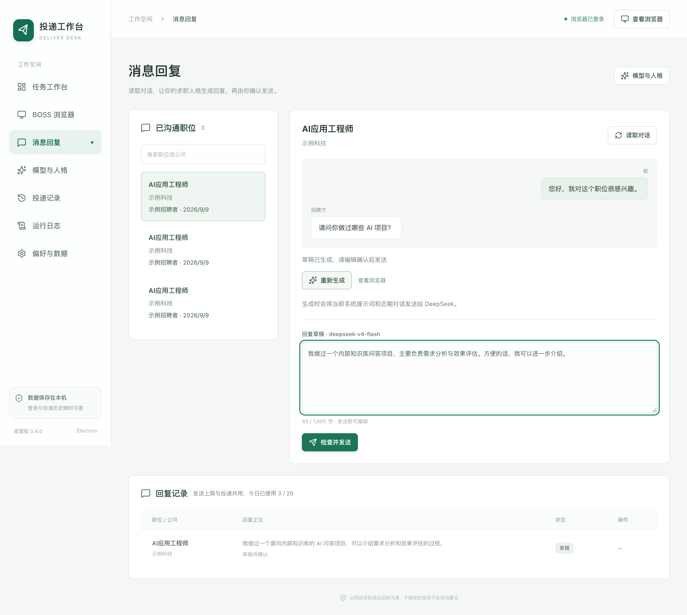

# DeepSeek 与消息回复

消息回复目前支持 BOSS 直聘。先配置模型和个人提示词，再到“消息回复”开启自动回复，或选择会话生成草稿、编辑并确认发送。智联后续聊天请在求职浏览器中的智联网页处理。

## 配置模型

1. 打开侧栏 **模型与人格**，粘贴自己的 DeepSeek API Key，点击 **保存密钥**。
2. 点击 **测试连接并刷新模型**。这一步只获取模型列表，不上传聊天内容。
3. 选择模型；默认 `deepseek-v4-flash`，也可以选择 `deepseek-v4-pro` 或填写账户支持的模型 ID。
4. 编辑系统提示词和参数，点击 **保存模型配置**。切到回复页生成时，也会保存当前模型配置。

接口使用 [DeepSeek 官方 Chat Completions](https://api-docs.deepseek.com/api/create-chat-completion/)，以非流式方式接收完整正文。当前采用非思考模式；[官方文档](https://api-docs.deepseek.com/guides/thinking_mode/)说明 `thinking.type=disabled` 可关闭思考过程。程序不会把思考内容当作回复正文。



## 设置我的人格

可写入真实背景、目标职位、沟通风格、回答范围。下面的方括号需要替换成你自己的信息：

```text
你以我的身份和招聘者交流。
我的背景：[工作年限、岗位经历、可介绍的项目和技能]。
求职偏好：[城市、岗位、工作方式及其他要求]。
表达风格：自然、礼貌，用第一人称，根据问题决定长度，保证回答完整。
只依据我的资料和已有对话回答，不编造经历、技能、薪资或面试时间。
没有明确的信息先澄清，遇到重要承诺保留给我确认。
只输出一条待发送回复，不附分析、标题或解释。
```

系统提示词最多 20,000 字。表达灵活度范围为 0–2；近期消息条数为 2–50。应用不再设置 `max_tokens`，也不对回复正文施加 1,000 字限制；旧配置中的 Token 上限会被忽略。模型自身的上下文及输出容量仍由服务方决定。只有接口报告正常完成的正文才可发送；如果模型报告长度截断、只返回思考内容或正文为空，会停止并提示，不裁剪后发送。

## 自动监控与回复

1. 在 **消息回复** 点击 **扫描待回复**，可先查看待回复数量。这一步只读取网站已有会话，不调用模型，也不发送消息；读取会话可能使网站的未读角标清零。
2. 打开页面顶部的 **自动回复** 开关。程序扫描网站“全部”会话，逐一核对联系人、公司及当前职位，再读取近期消息；不要求会话由本工具最初发起。
3. 最后一条可识别消息来自招聘方，且你还没有回复时，自动调用已保存的模型与人格设置生成并发送。已读但尚未回复的消息同样处理；最后一条是本人消息时等待对方继续回复。
4. 每轮扫描完成后等待 30 秒再检查；遇到投递或手动回复任务时等待该任务结束。连续新消息到来时先等消息稳定；生成或发送前发现变化会放弃旧内容，重新读取。
5. 关闭开关会停止后续检查并取消正在生成的请求。退出、崩溃或重启应用后保持关闭，需要本人再次开启。



**回复日志** 保留开启、发现、生成、跳过、发送、回执与错误，**回复记录** 显示完整正文、时间、来源及结果。网页已有草稿、附件或无法核对的联系人会跳过并注明原因；模型连接失败、登录失效或达到每日发送上限时关闭监控。发送中断或回执不明时标为待核对，同一会话不会自动补发；重新开启开关也不会绕过待核对记录。



## 回复消息

1. 打开 **消息回复**，在左侧选择已沟通的职位；包含投递记录和扫描发现的会话，可按职位、公司或招聘者搜索。
2. 点击 **读取对话**。程序进入网站完整聊天页，核对目标职位和公司，显示近期已加载的消息。此时不调用模型。
3. 点击 **生成回复草稿**。最近的对话按招聘方和本人区分角色发送给 DeepSeek；接口不保存应用侧会话，需要逐次提供上下文，参见[多轮对话说明](https://api-docs.deepseek.com/guides/multi_round_chat/)。
4. 编辑草稿，点击 **检查并发送**。核对公司、职位与正文后，再点击 **确认发送这条回复**。
5. 在下方 **回复记录** 查看结果。确认送达后等待对方的新消息，再读取对话继续回复。



仅在最后一条消息来自招聘方且为可识别的纯文字时生成回复。图片、文件、超长或无法识别的最新消息需要在浏览器手动处理。

生成期间或等待发送时出现新消息、切换收件人、输入框已有其他草稿，都会阻止继续发送。网站出现送达或已读回执后才记为成功；回执不明确或发送中断时，记录为待核对。请到浏览器核对后，通过 **人工核实** 填写结果与说明。不会自动补发。

## 数据与错误处理

- API Key 加密保存在本机，不出现在配置导出中。系统密钥存储不可用时不会改用明文保存；换电脑后需要重新填写密钥。
- 配置导出包含系统提示词，可能带有你填写的个人资料。草稿、选中的对话上下文和回复结果保存在本地历史中。
- 手动生成或开启自动回复后，会向 DeepSeek 发送本次需要回复的会话近期消息、系统提示词、职位名称及公司。不会上传 Cookie、登录状态或简历文件。
- 回复和首次投递共用每日尝试上限。生成草稿不占发送次数；已预占的发送即使中断，也保留计数。
- 密钥无效、余额不足、请求限流、超时和服务繁忙会显示对应提示，不会自动重试请求或发送。错误含义见[官方错误码](https://api-docs.deepseek.com/quick_start/error_codes/)。

开发验证使用临时数据目录、虚构密钥、模拟 DeepSeek 响应和合成招聘页面，覆盖手动回复、自动扫描、完整长回复、定时检查、回执、新消息、中断与去重。实际模型输出质量及账户可用模型，需要使用你自己的 API Key 验证。
