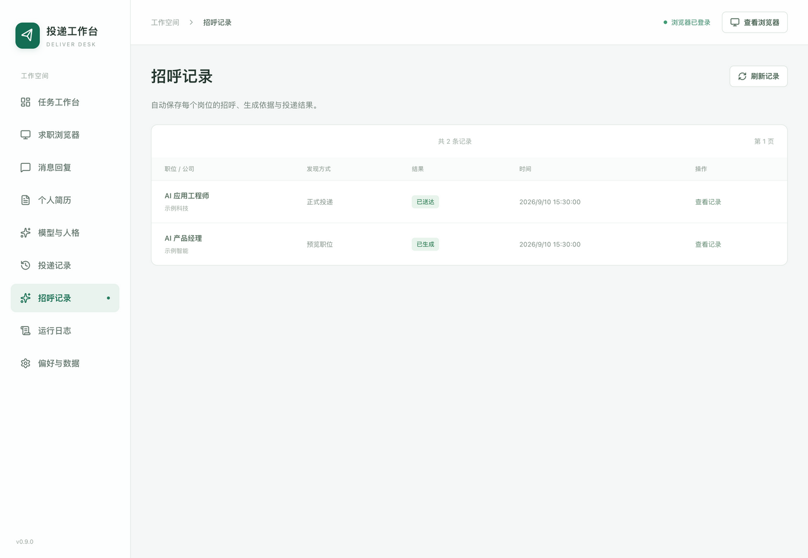

# 简历与岗位招呼

此功能支持 BOSS 直聘和智联招聘。上传个人简历后，可由 DeepSeek 提取经历和优势，再结合每个应聘岗位生成专属招呼。需要先在“模型与人格”保存 DeepSeek API Key，并选择可用模型。智联会先将本岗位招呼保存为网站默认招呼，再投递账户中的在线简历；本地上传的简历用于生成招呼，不会替换智联在线简历。

## 上传与分析

1. 打开“个人简历”，点击“上传简历”，选择 PDF、DOCX 或 TXT；也可直接粘贴正文。
2. 检查提取的文字。多栏 PDF 可能需要调整阅读顺序，修改后点击“保存正文”，或直接点击“分析简历”保存并分析。
3. DeepSeek 会整理“个人概况”“核心技能”“代表经历与成果”“岗位优势”。核对是否符合真实经历；每栏可编辑，列表每行一项，点击“保存特点”生效。
4. 点击“使用 AI 岗位招呼”回到任务工作台。

文件最大 10 MB，正文最多 60,000 字，PDF 最多 50 页。不支持加密 PDF、旧版 DOC 和只有图片的扫描件；请解密、另存为 DOCX，或转成文字后粘贴。导入失败会保留此前简历，不会截断正文后继续分析。

## 自动生成与投递

1. 在“打招呼内容 → 沟通方式”选择“AI 岗位招呼”。
2. 可在“AI 招呼要求”填写希望突出的经历、语气或表达方式，例如“突出知识库项目与岗位的联系，语气自然，邀请进一步交流”。模型也会参考已保存的系统提示词，个人事实以简历为依据。
3. 点击“预览职位”或直接“开始投递”。发现符合条件、尚未沟通的岗位后，会自动读取 JD，结合当前简历正文与特点生成招呼，无需逐岗选择或点击生成。
4. 预览会调用模型并保存完整招呼，不联系招聘方、不占用投递次数，也不修改智联网站的招呼设置。正式投递确认一次本次范围后，自动逐岗生成或沿用已有招呼，核对目标并发送。
5. 打开“招呼记录”查看完整正文、当时的岗位 JD、简历特点与版本、表达要求、使用模型和处理结果。记录在重启后保留，任务运行中也可查看。

相同岗位的 JD、简历和生成配置未变时，自动沿用已生成的招呼，不重复调用模型；任一项变化后重新生成。每次使用都会留下独立记录，已沟通的岗位继续按投递历史去重。

招呼优先突出最相关的真实项目、个人贡献与成果，用具体证据说明岗位匹配点。生成失败、结果为空或模型报告截断时，任务会在发起沟通前停止，并保留失败原因。停止或异常退出也会保留处理状态；无法确认的发送不会自动重试。

## 智联逐岗设置

选择智联与 AI 岗位招呼后，正式投递按“读取 JD 与简历 → 生成招呼 → 保存为智联自定义默认招呼 → 重新加载核对 → 投递 → 比对实际回执”的顺序逐岗执行。相同资料可复用预览时生成的正文，但每次投递前仍会保存并核对本岗位的网站设置。

智联生成时同时返回正文和简历依据。应用检查摘录能否在上传的简历原文中找到、对应短语是否出现在招呼里，并拦截简历未提供的英文技能词，避免把 JD 的要求直接当成本人能力；出处缺失时停止。依据随正文保存，可在“招呼记录 → 招呼中的简历依据”查看。仍需本人核对事实和表达，引用检查不能保证所有语义判断无误。

应用只复用自己创建的招呼条目，不覆盖其他自定义模板。任务完成、停止或出现错误时会恢复运行前的默认招呼；强制退出后，下次正式任务会先检查恢复。运行期间手动另选的默认招呼不会被覆盖。设置页加载、保存或默认标记未确认时不点击投递；实际招呼与原文不同会保留两者与待核对状态，停止并禁止自动重发。

## 修改、移除与数据

- 上传新文件或保存修改后的正文，会清除旧分析，需重新分析；已有招呼记录保留。
- 编辑并保存特点后，后续发现和投递岗位会自动使用新版本。任务运行或自动回复开启时，先停止再修改简历。
- “移除简历”删除本机导入的正文和分析结果，保留原始文件、既有招呼、投递与回复记录。
- 导入只在本机解析；点击分析时，简历正文发送至 DeepSeek。预览或正式使用 AI 岗位招呼时，还会发送已保存的特点、表达要求和相关岗位资料。
- 简历与分析结果保存在本机，不随配置导出；招呼记录包含当时的岗位 JD、简历特点与引用的简历原句，请按个人资料保管；已发送招呼也会进入投递记录和 CSV。简历不会自动作为附件发送给招聘方。

BOSS 保留完整模型输出，不额外设置招呼 Token 或字数上限。智联按网站的 500 字限制生成完整招呼（表情可能占两个字符），超长时停止，不截断发送。真实经历仍需本人核对；提示词要求不编造项目、年限、学历或成果，并避免主动附上联系方式等私人信息。
