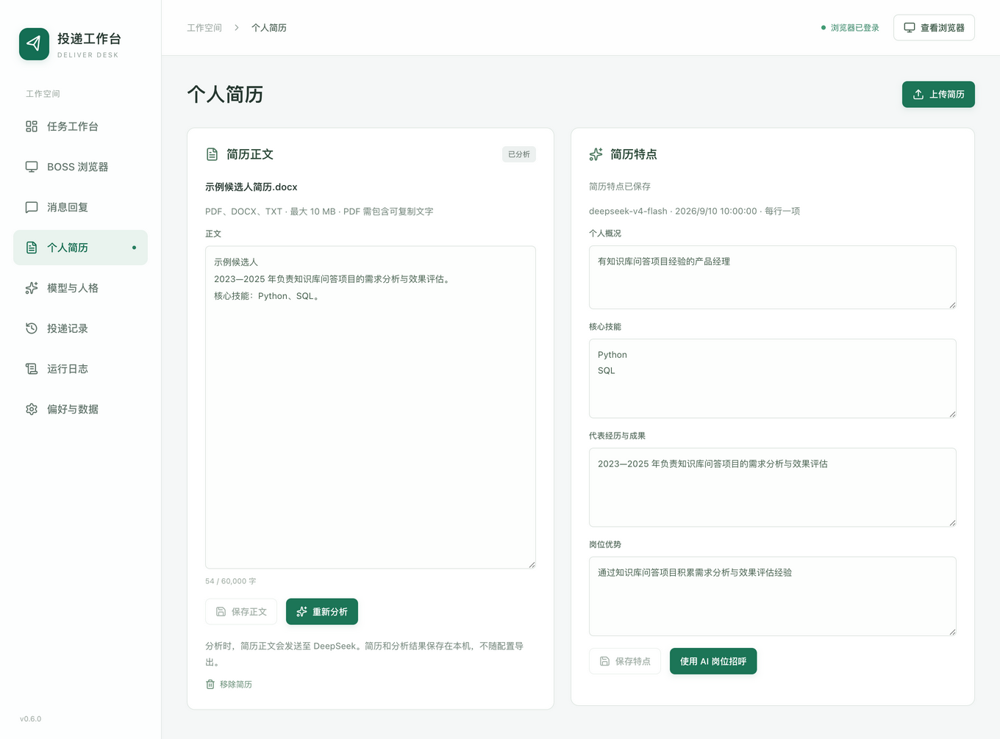
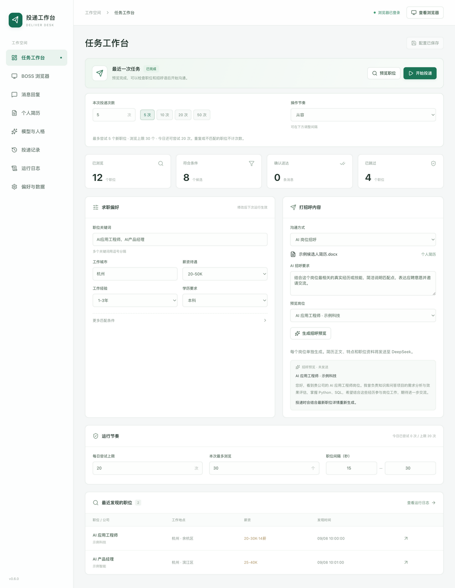

# 简历与岗位招呼

上传个人简历后，可由 DeepSeek 提取经历和优势，再结合每个应聘岗位生成专属招呼。需要先在“模型与人格”保存 DeepSeek API Key，并选择可用模型。

## 上传与分析

1. 打开“个人简历”，点击“上传简历”，选择 PDF、DOCX 或 TXT；也可直接粘贴正文。
2. 检查提取的文字。多栏 PDF 可能需要调整阅读顺序，修改后点击“保存正文”，或直接点击“分析简历”保存并分析。
3. DeepSeek 会整理“个人概况”“核心技能”“代表经历与成果”“岗位优势”。核对是否符合真实经历；每栏可编辑，列表每行一项，点击“保存特点”生效。
4. 点击“使用 AI 岗位招呼”回到任务工作台。

文件最大 10 MB，正文最多 60,000 字，PDF 最多 50 页。不支持加密 PDF、旧版 DOC 和只有图片的扫描件；请解密、另存为 DOCX，或转成文字后粘贴。导入失败会保留此前简历，不会截断正文后继续分析。

## 预览与投递

1. 在“打招呼内容 → 沟通方式”选择“AI 岗位招呼”。
2. 在“AI 招呼要求”填写希望突出的经历、语气或表达方式，例如“突出知识库项目与岗位的联系，语气自然，邀请进一步交流”。模型也会参考已保存的系统提示词，但个人事实以简历为依据。
3. 先点击“预览职位”获取岗位，再从“预览岗位”选择一个职位，点击“生成招呼预览”。此操作调用模型但不联系招聘方、不占用投递次数。
4. 点击“开始投递”，确认本次范围与简历。每个匹配岗位会根据最新的职位详情、简历正文和特点分别生成招呼，随后核对目标并发送。
5. 在“投递记录”查看完整招呼和结果。生成失败、结果为空或模型报告截断时，任务会在发起沟通前停止；不会替换成通用模板继续发送。

普通“预览职位”只读取和匹配岗位，不逐个调用模型。单条招呼预览绑定所选岗位、简历版本和招呼配置；更改后需重新预览。正式投递会重新生成，不保证与预览文字完全相同。

## 修改、移除与数据

- 上传新文件或保存修改后的正文，会清除旧分析和招呼预览，需重新分析。
- 编辑并保存特点后，再生成预览和开始投递。任务运行或自动回复开启时，先停止再修改简历。
- “移除简历”删除本机导入的正文和分析结果，保留原始文件、既有投递与回复记录。
- 导入只在本机解析；点击分析时，简历正文发送至 DeepSeek。预览或正式使用 AI 岗位招呼时，还会发送已保存的特点、表达要求和相关岗位资料。
- 简历与分析结果保存在本机，不随配置导出；已发送招呼会进入投递记录和 CSV。简历不会自动作为附件发送给招聘方。

支持保留完整模型输出，不额外设置招呼 Token 或字数上限。真实经历仍需本人核对；提示词要求不编造项目、年限、学历或成果，并避免主动附上联系方式等私人信息。
